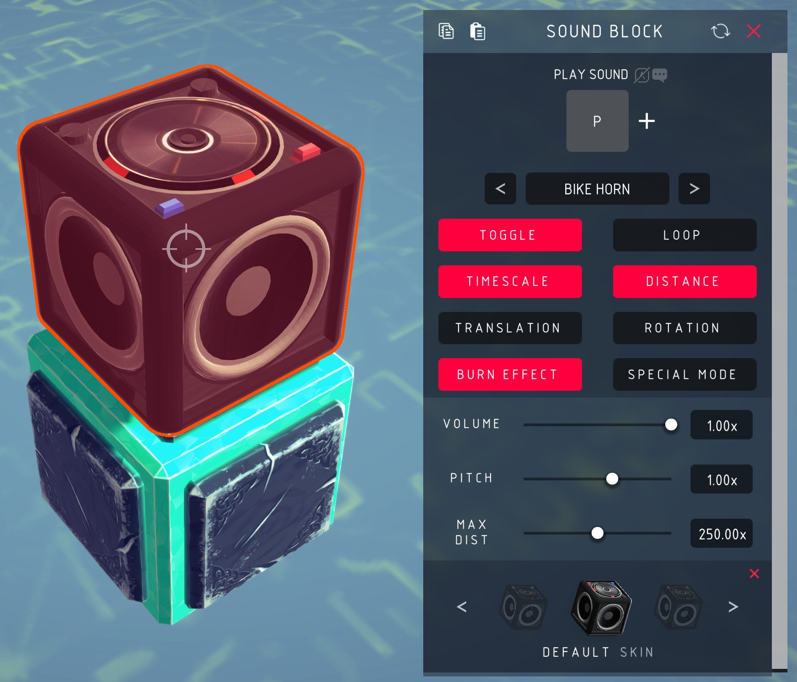
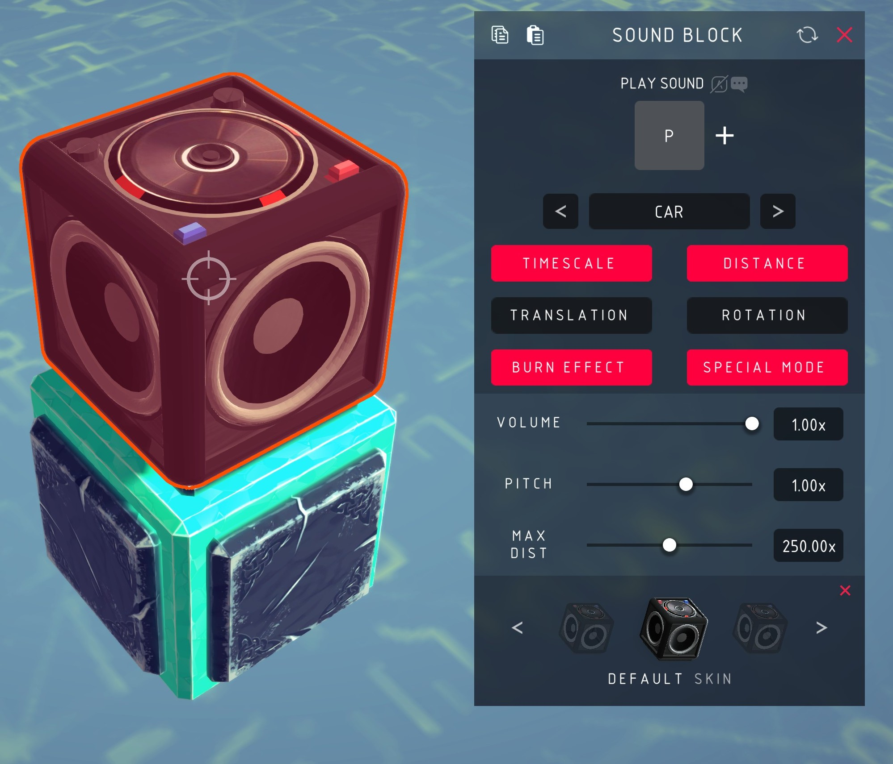

# Besiege Sound Blocks

A block that plays sounds, in [Besiege](https://store.steampowered.com/app/346010/Besiege/).



Pick a clip, map a key, and it plays. Beyond that the block is about *how* it
plays: hold or toggle, one-shot or looping, pitched by the game's slow-motion,
pitched by how fast the block moves or spins, heard across the map or falling off
with distance. Set it on fire and it winds up and dies like a real speaker.

Multiplayer works — everyone hears everyone's blocks. Custom sounds don't travel,
so only players who have the same files hear those.

## Install

Either subscribe to the mod on Steam, or if you don't use Steam you can clone the repo then:

```sh
./tools/install.sh              # symlink into Besiege_Data/Mods
./tools/install.sh --copy       # copy instead
./tools/install.sh --uninstall
```

Set `BESIEGE_DIR` if your install isn't found automatically. Start Besiege, enable **Sound Blocks** in the mods menu, and the Sound Block appears in the block toolbar. No C# toolchain is needed, the build uses Besiege's own compiler.

## Options

The pane sizes itself to what is showing: turning on **Distance** or a velocity
mode adds its slider and the window grows, and it shrinks again when they go.
Nothing scrolls.

| Setting | What it does |
| --- | --- |
| Play Sound | Key that plays the clip. Default `P` |
| Sound menu | Which clip |
| Toggle | On, the key starts and stops playback. Off, it plays only while held |
| Loop | Repeat until stopped |
| TimeScale | Pitch follows the game's slow-motion |
| Distance | Falls off with distance instead of being heard everywhere |
| Max Dist | Distance at which it goes silent. Only shown with **Distance** on |
| Translation | Pitch rises with how fast the block moves |
| Rotation | Pitch rises with how fast the block spins |
| Min / Max velocity pitch | Floor and ceiling for that pitch. Shown when either mode is on |
| Burn effect | On fire, the block winds up and gives out |
| Volume | 0 to 1 |
| Pitch | Unclamped. **Negative plays the clip backwards** |

With **Translation** and **Rotation** both on, the livelier of the two motions
drives the sound.

## Special Mode



A three-clip engine instead of a single sound. Press the key and clip 1 starts;
once it finishes clip 2 loops for as long as you hold; release and clip 3 plays.
Start, idle, shutdown. **Car** and **Plane** ship with the mod.

Turning it on replaces the sound menu, **Toggle** and **Loop** with the mode menu,
since none of them apply.

## Adding your own sounds

No rebuild needed — the clip list lives in the block's XML.

1. Drop an `.ogg` in `Resources/Sounds/`.
2. Declare it in `Mod.xml`:
   `<AudioClip name="MySound" path="Sounds\MySound.ogg" />`
3. **Append** it to `<Sounds>` in `SoundBlock.xml`:
   `<AudioClip name="MySound" />`

Append, do not insert. A machine saves its choice as an index into that list, so
inserting anywhere but the end repoints every already-saved block at a different
sound.

A custom Special Mode is the same idea with three clips. Declare all three in
`Mod.xml`, then add the mode to `<CustomMode>` in `SoundBlock.xml`:

```xml
<Mode name="MyMode" Sound_1="ClipA" Sound_2="ClipB" Sound_3="ClipC" />
```

If you subscribed on Steam, your files live under
`steamapps/workshop/content/346010/1493925387/` — back them up, since an update
to the mod replaces that folder.

## Notes

The C# for this mod was lost and has been recovered from the shipped 2018
assembly. [docs/RECOVERY.md](docs/RECOVERY.md) is the record of how, and how far
the result can be trusted. [CHANGELOG.md](CHANGELOG.md) lists what was broken in
that build and has since been fixed — including the one that mattered most, where
a machine with several sound blocks played the wrong sounds or stopped playing at
all. Those machines are repaired on load.

Installing by symlink makes the repository itself the folder Besiege loads, which
is also what gets uploaded to the Workshop. The game writes the generated `<ID>`
into `Mod.xml` the first time it loads the mod; with a symlink that write lands in
your working copy, which is what you want — the ID must stay stable for the life
of the mod, so commit it.

Details land in `Player.log` and in the in-game console with `show_logs true`.

AI agent? see [AGENTS.md](AGENTS.md) for layout, build, and any relevant info.
